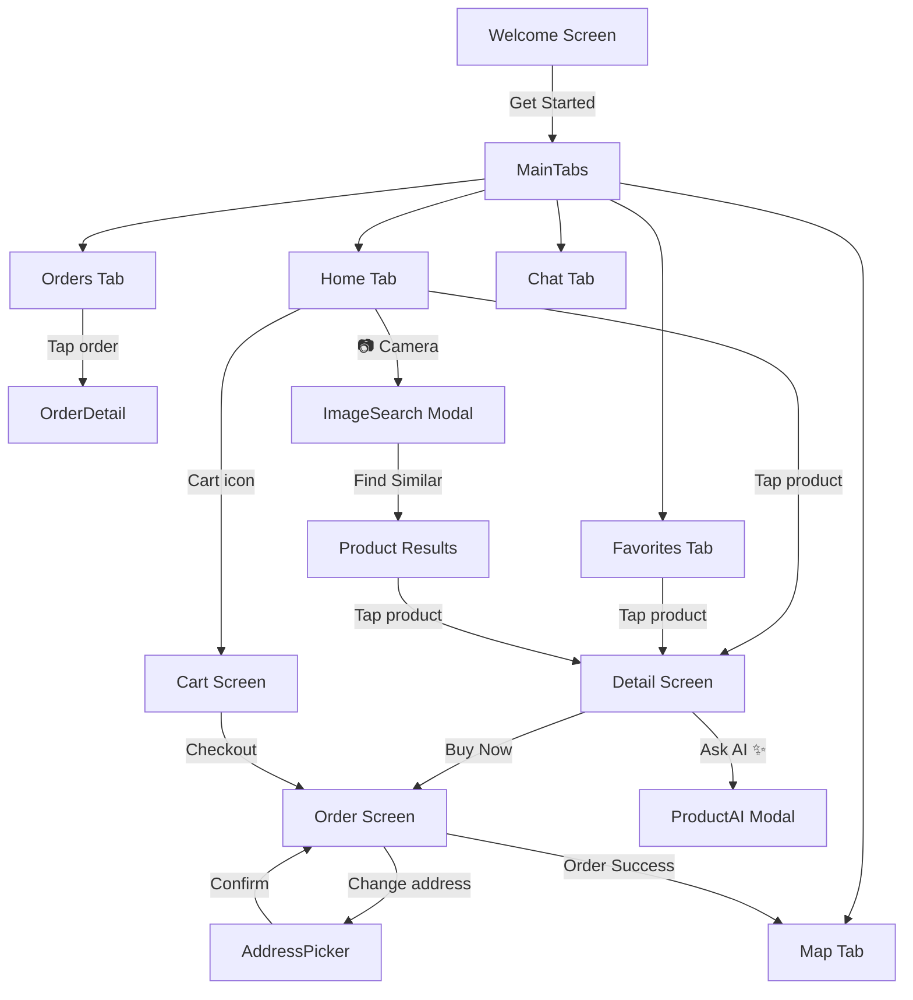

# 📱 LuxBag — Phân tích Toàn bộ Source Code

> **React Native (Expo SDK 54)** — Ứng dụng Mua sắm Túi xách Cao cấp  
> **Cập nhật lần cuối:** 09-03-2026  
> **Tổng số file:** 48 file mã nguồn  
> **Công nghệ (Tech stack):** React Native 0.81 · Expo 54 · AsyncStorage · Gemini AI · MockAPI

---

## 📑 Mục lục

1. [Tổng quan Kiến trúc](#1-tổng-quan-kiến-trúc)
2. [Cấu trúc Dự án](#2-cấu-trúc-dự-án)
3. [Luồng Điều hướng (Navigation Flow)](#3-luồng-điều-hướng-navigation-flow)
4. [Luồng Dữ liệu & Quản lý State](#4-luồng-dữ-liệu--quản-lý-state)
5. [Màn hình (11)](#5-màn-hình-11)
6. [Các Components (10)](#6-các-components-10)
7. [Custom Hooks (5)](#7-custom-hooks-5)
8. [Context Providers (2)](#8-context-providers-2)
9. [Tầng API (3)](#9-tầng-api-3)
10. [Lưu trữ / Tiện ích (5)](#10-lưu-trữ--tiện-ích-5)
11. [Giao diện (Styles - 10)](#11-giao-diện-styles---10)
12. [Thư viện phụ thuộc (Dependencies)](#12-thư-viện-phụ-thuộc-dependencies)
13. [Tóm tắt Tính năng Chính](#13-tóm-tắt-tính-năng-chính)
14. [Mô hình Dữ liệu (Data Model)](#14-mô-hình-dữ-liệu-data-model)

---

## 1. Tổng quan Kiến trúc

```
┌─────────────────────────────────────────────────────┐
│                      App.js                         │
│  GestureHandlerRootView > CartProvider >             │
│  FavoritesProvider > SafeAreaProvider > AppNavigator │
└──────────────────────┬──────────────────────────────┘
                       │
         ┌─────────────┴─────────────┐
         │      AppNavigator         │
         │  (Stack + Bottom Tabs)    │
         └─────────────┬─────────────┘
                       │
    ┌──────────────────┼──────────────────┐
    │                  │                  │
 Stack Screens     Tab Screens      Modal / Sheet
 ┌───────────┐   ┌────────────┐   ┌──────────────┐
 │ Welcome   │   │ Home       │   │ FilterModal  │
 │ Detail    │   │ Favorites  │   │ ImageSearch  │
 │ Order     │   │ Orders     │   │ ProductAI    │
 │ Address   │   │ Map        │   │ WriteReview  │
 │ OrderDtl  │   │ Chat (AI)  │   │ BottomSheet  │
 │ Cart      │   └────────────┘   └──────────────┘
 └───────────┘
```

**Design Pattern:** Cấu trúc dự án theo tính năng (Feature-based) với sự phân tách rõ ràng:

- `screens/` — Toàn bộ các trang/màn hình
- `components/` — Các phần tử giao diện dùng chung (reusable UI)
- `hooks/` — Các React hook tùy chỉnh cho logic nghiệp vụ
- `context/` — State toàn cục (React Context API)
- `api/` — Gọi API bên ngoài (MockAPI, Gemini)
- `utils/` — Các tệp thực hiện CRUD với AsyncStorage
- `styles/` — File StyleSheet riêng cho từng màn hình

---

## 2. Cấu trúc Dự án

```
HandBags/
├── App.js                          # Điểm bắt đầu (entry point), bọc các Providers
├── package.json                    # Khai báo thư viện & scripts
└── src/
    ├── api/
    │   ├── handbagApi.js           # Client gọi MockAPI.io (Axios)
    │   ├── geminiApi.js            # Gemini chat API (Chat AI cơ bản)
    │   └── geminiVisionApi.js      # Gemini Vision API (Phân tích ảnh + Hỏi đáp SP)
    ├── components/
    │   ├── CustomBottomSheet.js    # Wrapper cho @gorhom/bottom-sheet
    │   ├── FilterModal.js          # Bộ lọc nâng cao (danh mục/sắp xếp/giới tính)
    │   ├── ImageSearchModal.js     # 📷 Camera/Thư viện → AI → Tìm sp tương tự
    │   ├── InfoRow.js              # Hàng thông tin text (dùng trong Detail)
    │   ├── ProductAI.js            # ✨ Trợ lý AI (chatbot) tư vấn riêng về sản phẩm
    │   ├── RatingSummary.js        # Thanh thống kê điểm đánh giá (Detail screen)
    │   ├── ReviewCard.js           # Thẻ hiển thị một đánh giá với avatar
    │   ├── StarRow.js              # Cụm sao đánh giá (tương tác/chỉ đọc)
    │   ├── SwipeableCard.js        # Thẻ vuốt để xóa (dùng cho Favorites + Cart)
    │   └── WriteReview.js          # Form viết đánh giá sản phẩm
    ├── constants/
    │   └── mapStyle.js             # Mảng JSON cấu hình giao diện Google Maps
    ├── context/
    │   ├── CartContext.js           # 🛒 Quản lý state của Giỏ hàng
    │   └── FavoritesContext.js      # ❤️ Quản lý state Danh sách yêu thích
    ├── hooks/
    │   ├── useDetail.js            # Tính toán dữ liệu hiển thị (giá gốc, icon giới tính...)
    │   ├── useFavoriteList.js      # Logic yêu thích + chế độ chọn nhiều items
    │   ├── useHandbags.js          # Lấy SP + Lọc + Tìm kiếm
    │   ├── useUserLocation.js      # Lấy GPS với fallback về trung tâm TP.HCM
    │   └── useUserReviews.js       # CRUD cho các bài review của user
    ├── navigation/
    │   └── AppNavigator.js         # Cấu hình Stack + Tab navigator
    ├── screens/
    │   ├── WelcomeScreen.js        # Splash / onboarding
    │   ├── HomeScreen.js           # 🏠 Lưới SP + Tìm kiếm + Bộ lọc
    │   ├── DetailScreen.js         # 📋 Chi tiết SP + Reviews + AI tư vấn
    │   ├── FavoriteScreen.js       # ❤️ DS yêu thích (vuốt xóa / multi-select)
    │   ├── CartScreen.js           # 🛒 Giỏ hàng (UX giống hệt màn Favorites)
    │   ├── OrderScreen.js          # 📦 Checkout (giao hàng/nhận tại cửa hàng + nhiều SP)
    │   ├── OrderHistoryScreen.js   # 📜 DS đơn hàng đã đặt
    │   ├── OrderDetailScreen.js    # 📑 Chi tiết 1 đơn hàng + trạng thái
    │   ├── MapScreen.js            # 🗺️ Theo dõi tài xế giao hàng trên bản đồ
    │   ├── AddressPickerScreen.js  # 📍 Chọn địa chỉ qua bản đồ
    │   └── ChatScreen.js           # 🤖 Chatbot AI chung (LuxBag AI)
    ├── styles/                     # 10 file StyleSheet (mỗi screen 1 file)
    └── utils/
        ├── storage.js              # CRUD cho ds Yêu thích (AsyncStorage)
        ├── cartStorage.js          # CRUD cho Giỏ hàng (AsyncStorage)
        ├── orderStorage.js         # CRUD cho Đơn hàng (AsyncStorage)
        ├── reviewStorage.js        # CRUD cho bài đánh giá của user
        └── mockReviews.js          # Tạo bài đánh giá mẫu (với thuật toán cố định)
```

---

## 3. Luồng Điều hướng (Navigation Flow)



### Cấu trúc Navigator

| Navigator         | Loại         | Các Màn hình                                                       |
| ----------------- | ------------ | ------------------------------------------------------------------ |
| `Stack.Navigator` | Native Stack | Welcome, MainTabs, Detail, Order, AddressPicker, OrderDetail, Cart |
| `Tab.Navigator`   | Bottom Tabs  | Home, Favorites, Orders, Map, Chat                                 |

### Cấu hình Tab Bar

- **Màu Active:** `#D4A574` (vàng ánh kim)
- **Màu Inactive:** `#BFBFBF`
- **Indicator:** thanh ngang nhỏ xíu bên dưới icon khi active
- **Chiều cao:** 60px có bóng đỗ (elevation shadow)

---

## 4. Luồng Dữ liệu & Quản lý State

### Global State (Context API)

```
App.js
├── CartProvider (CartContext)
│   ├── cart: Array<CartItem>
│   ├── addItem(product, qty)
│   ├── updateQty(name, qty)
│   ├── removeItem(name)
│   ├── clearAll()
│   ├── totalItems: number
│   └── totalPrice: number
│
└── FavoritesProvider (FavoritesContext)
    ├── favorites: Array<Product>
    ├── isFavorite(name): boolean
    ├── toggleFav(product)
    ├── clearFav()
    ├── removeBatch(namesSet)
    └── reloadFavorites()
```

### Các Nguồn Dữ liệu

| Nguồn         | Công nghệ                     | Mục đích                                            |
| ------------- | ----------------------------- | --------------------------------------------------- |
| MockAPI.io    | Axios REST                    | Danh mục sản phẩm                                   |
| AsyncStorage  | `@react-native-async-storage` | Lưu Favorites, Cart, Đơn đặt hàng, Reviews          |
| Gemini API    | `fetch` REST                  | Trò chuyện AI & Tư vấn sản phẩm                     |
| Gemini Vision | `fetch` REST + base64         | Phân tích ảnh để tìm kiếm                           |
| OpenStreetMap | Nominatim API                 | Lấy thông tin địa chỉ từ tọa độ (Reverse geocoding) |
| expo-location | Device GPS                    | Lấy tọa độ thật của người dùng                      |

### Các Key của AsyncStorage

| Key                  | Dữ liệu chứa                               | Dùng bởi           |
| -------------------- | ------------------------------------------ | ------------------ |
| `@favorite_handbags` | Mảng chứa SP yêu thích                     | `storage.js`       |
| `@shopping_cart`     | Mảng chứa Giỏ hàng (kèm quantity)          | `cartStorage.js`   |
| `@handbag_orders`    | Mảng chứa Đơn hàng đã đặt                  | `orderStorage.js`  |
| `@user_reviews`      | Object lưu review theo key là tên túi xách | `reviewStorage.js` |

---

## 5. Màn hình (11 Screens)

### 5.1 WelcomeScreen

- **File:** `screens/WelcomeScreen.js` + `styles/WelcomeStyles.js`
- **Mục đích:** Màn hình khởi động với ảnh nền full-screen.
- **Tính năng nổi bật:** Ảnh nền `expo-image`, có `expo-linear-gradient` che phủ tạo chiều sâu, nút "Get Started".

### 5.2 HomeScreen ⭐

- **File:** `screens/HomeScreen.js` (364 lines) + `styles/HomeStyles.js`
- **Mục đích:** Giao diện duyệt sản phẩm chính.
- **Tính năng nổi bật:**
  - 🔍 **Thanh tìm kiếm:** Tìm theo tên hộp chữ, góc phải có thêm icon 📷 camera để tìm bằng ảnh (Image Search).
  - 🏷️ **Lọc theo thương hiệu (Brand):** Cuộn ngang (All, Bvlgari, Michael Kors, ...).
  - 📐 **Lưới 2 cột:** Hiển thị mượt mà.
  - ❤️ **Icon tim:** Lưu yêu thích tức thì.
  - 🛒 **Icon thêm vào giỏ:** Nút có icon `bag-add-outline`.
  - 🎨 **Hiệu ứng cuộn:** Ẩn header mượt mà.
  - 🔄 **Vuốt để làm mới (Pull-to-refresh).**
  - ⚙️ **Bộ lọc mở rộng:** Category, chiều sắp xếp (Sort), giới tính.

### 5.3 DetailScreen ⭐

- **File:** `screens/DetailScreen.js` (297 lines) + `styles/DetailStyles.js`
- **Mục đích:** Hiển thị thông tin chi tiết của 1 túi xách.
- **Tính năng nổi bật:**
  - 📸 Ảnh SP full-width ở trên.
  - 💰 Giá thực + Giá gốc (có format gạch ngang) + % giảm.
  - 📊 Bảng thông số kỹ thuật (Danh mục, Giới tính, Màu sắc...).
  - ⭐ Box tổng hợp đánh giá và thanh tiến độ.
  - 💬 Phần bình luận mẫu + chức năng viết bình luận (Write Review) kèm ảnh.
  - ✨ **Nút nổi "Ask AI":** Bấm vào mở `ProductAI` hỏi xoáy đáp xoay về chính chiếc túi này.
  - 🛒 Thanh mua nhanh dưới cùng: "Add to Cart" & "Buy Now".

### 5.4 FavoriteScreen

- **File:** `screens/FavoriteScreen.js` (197 lines) + `styles/FavoriteStyles.js`
- **Mục đích:** Quản lý danh sách Yêu thích.
- **Tính năng nổi bật:**
  - 👆 **Vuốt thẻ để xóa (SwipeableCard).**
  - 👆 **Nhấn giữ để chọn nhiều (Multi-select).**
  - ✅ Overlay hiển thị checkbox khi đang ở chế độ chọn.
  - 🗑️ Thanh nổi xóa hàng loạt (Floating delete bar).
  - 📤 Nút "Select All" / "Deselect All".

### 5.5 CartScreen

- **File:** `screens/CartScreen.js` (303 lines)
- **Mục đích:** Giỏ hàng người dùng.
- **Tính năng nổi bật:**
  - **Sử dụng lại Style & UX của Favorite:** vuốt thẻ để xóa, nhấn giữ để chọn.
  - 🛒 Badge (huy hiệu) hiển thị × số lượng item.
  - 💰 Thanh thanh toán nổi, tính tổng tiền.
  - 💳 Nút Checkout truyền thẳng **tất cả sản phẩm (cartItems)** sang OrderScreen.

### 5.6 OrderScreen

- **File:** `screens/OrderScreen.js` (587 lines) + `styles/OrderStyles.js`
- **Mục đích:** Xem trước, tạo đơn và thanh toán giao hàng.
- **Tính năng nổi bật:**
  - 🚚 **Hai phương thức:** Giao tận nơi (Deliver) / Nhận tại shop (Pick up).
  - 📍 Lấy và thay đổi địa chỉ (có mở rộng sang Maps Picker).
  - 🏪 Chọn cửa hàng lân cận (tính khoảng cách GPS từ user).
  - 📦 **Xử lý đa sản phẩm:** Hỗ trợ từ Checkout (giỏ hàng nhiều item) hoặc Buy Now (1 item). Cho phép +- thay đổi số lượng tại đây.
  - 💰 Tóm tắt thanh toán: tính tiền tổng, cả phụ phí giao hàng (Delivery Fee) và Mã giảm giá (Discount).
  - ✅ Màn hình overlay báo "Đặt thành công" với các hướng dẫn bước tiếp. Xóa luôn cart (nếu đến từ CartScreen).

### 5.7 OrderHistoryScreen

- **File:** `screens/OrderHistoryScreen.js` (186 lines) + `styles/OrderHistoryStyles.js`
- **Mục đích:** Liệt kê các đơn trong quá khứ và đang giao.
- **Tính năng nổi bật:** Filter dạng tab (Tất cả, Delivery, Pick up), badges trạng thái màu mè.

### 5.8 OrderDetailScreen

- **File:** `screens/OrderDetailScreen.js` (357 lines) + `styles/OrderDetailStyles.js`
- **Mục đích:** Xem lại hóa đơn và lộ trình đơn hàng.
- **Tính năng:**
  - 📊 Thanh progress bar "Confirmed → Preparing → On The Way → Delivered".
  - 🗺️ Nút "Track on Map" mở thẳng định vị tài xế.
  - ✅ Nút "Đã nhận hàng" giả lập chu kỳ hoàn thành đơn.

### 5.9 MapScreen

- **File:** `screens/MapScreen.js` (581 lines) + `styles/MapStyles.js`
- **Mục đích:** Tracking đơn giao hàng Real-time (demo).
- **Tính năng nổi bật:**
  - Tích hợp `react-native-maps`, dùng JSON custom style (để map nổi màu vàng đồng sang trọng).
  - Icon tài xế di chuyển từ nhà cung cấp sang nhà người dùng trên map.
  - Tính thời gian ước tính (ETA).
  - Bottom sheet để vuốt xem lại list item.

### 5.10 AddressPickerScreen

- **File:** `screens/AddressPickerScreen.js` (438 lines)
- **Mục đích:** Di chuyển kim chọn vị trí thật tế để định hình chỗ cần giao.
- **Tính năng nổi bật:** Gõ chữ tìm địa điểm (dùng Nominatim free API OpenStreetMap), reverse geocoding theo vị trí chọt pin.

### 5.11 ChatScreen

- **File:** `screens/ChatScreen.js` (279 lines) + `styles/ChatStyles.js`
- **Mục đích:** Trò chuyện hỏi đáp tổng quát với hệ thống AI (Gemini).
- **Tính năng nổi bật:** Giao diện bubble tin nhắn, chip gợi ý, chấm dots gõ chữ giả lập của AI. Có history lưu trong memory (Gemini nhớ câu cũ).

---

## 6. Các Components (10)

| Component           | File                   | Mô tả                                                                            | Chiều dài |
| ------------------- | ---------------------- | -------------------------------------------------------------------------------- | --------- |
| `SwipeableCard`     | `SwipeableCard.js`     | Thẻ cho phép vuốt màn hình sang trái để hiện nút Xóa (dùng Reanimated 2+Gesture) | 103       |
| `FilterModal`       | `FilterModal.js`       | Dùng `@gorhom/bottom-sheet` làm popup phân loại (Mức giá, giới tính)             | ~200      |
| `ImageSearchModal`  | `ImageSearchModal.js`  | 📷 Component cho phép chụp/upload ảnh để AI xử lý và trả về SP matching          | ~450      |
| `ProductAI`         | `ProductAI.js`         | ✨ Bot AI thông thái xuất hiện tại Màn Hình Chi Tiết - cho hỏi đặc vụ SP         | ~300      |
| `WriteReview`       | `WriteReview.js`       | Modal Bottom Sheet form review nhập Rating & Comment                             | ~150      |
| `ReviewCard`        | `ReviewCard.js`        | Ô hiển thị bình luận đã đăng                                                     | 42        |
| `RatingSummary`     | `RatingSummary.js`     | Biểu đồ thanh ngang thể hiện Breakdown 5* - 4* - 3\*...                          | ~80       |
| `StarRow`           | `StarRow.js`           | UI xuất ra 5 dải sao để chấm điểm. Có cả mode xem lẫn interact                   | ~30       |
| `InfoRow`           | `InfoRow.js`           | Chữ có bold + label + value nhẹ cho table info.                                  | ~20       |
| `CustomBottomSheet` | `CustomBottomSheet.js` | Wrapper linh hoạt dùng Reanimated Backdrop                                       | ~40       |

### Luồng Hoạt động (Flow) của ImageSearchModal

```
Chạm 📷 → Chọn Máy Cấm / Thư viện ảnh
  → Chụp/Chọn ảnh
  → Gửi base64 vào server Gemini Vision
  → Trả kết quả: Phân tích Brand, Category, Hình thù thiết kế, Màu sắc & Keywords
  → Click nút "Find Similar in App (X Products)"
  → Server nội bộ duyệt lại App catalog tính điểm từng sản phẩm tương tự:
      • Match Brand  : +5 pts
      • Match Category: +4 pts
      • Match Color   : +3 pts
      • Keyword Match : +2 pts
  → Modal render List sản phẩm từ điểm cao => thấp (Top 10)
  → Click => Mở trang chi tiết đồ.
```

### Luồng Hoạt động (Flow) của ProductAI

```
Chạm ✨ ở Detail Screen
  → AI Component bật lên đè màn hình, truyền dữ liệu sản phẩm đó lên.
  → Header gợi ý (vd "Túi này màu khác không?", "Vật liệu này cách vệ sinh?")
  → User hỏi → Prompt lồng info context vào → API trả lời chính xác đặc thù sản phảm.
```

---

## 7. Custom Hooks (5)

| Hook              | File                 | Mục đích                                                                  | Biến trả về (Returns)                                                   |
| ----------------- | -------------------- | ------------------------------------------------------------------------- | ----------------------------------------------------------------------- |
| `useHandbags`     | `useHandbags.js`     | Fetch từ API, quản lý State Loading, lọc Brand, gõ tìm text               | `{ handbags, filteredData, loading, searchText, BRANDS... }`            |
| `useFavoriteList` | `useFavoriteList.js` | Gom logic bấm chọn thẻ Yêu Thích và các Array ID đang tích (Tick list)    | `{ favorites, selectMode, selected, handleLongPress, toggleSelect... }` |
| `useDetail`       | `useDetail.js`       | Hook tính toán phụ cho logic chi tiết (Giá sale, icon nữ nam...)          | `{ fav, discountPercent, originalPrice, genderColor... }`               |
| `useUserReviews`  | `useUserReviews.js`  | Lấy và Set lên Local Storage bộ Comments riêng lẻ.                        | `{ userReviews, submitReview }`                                         |
| `useUserLocation` | `useUserLocation.js` | Kiểm tra Quyền (Permission) GPS và cập nhật. Có fall-back center ở TPHCM. | `{ location, loading, error, refresh }`                                 |

---

## 8. Context Providers (2)

### CartContext

```javascript
// Provider bao thư mục cao nhất của App (kèm Persistence AsyncStorage)
├── cart: [{ ...product, quantity: number }]
├── addItem(product, qty=1)    // Hàm gom nhóm túi cùng loại thì cộng qty lên
├── updateQty(name, newQty)    // Đổi số lượng trực tiếp (xóa nếu <=0)
├── clearAll()                 // Empty Array
└── totalItems, totalPrice     // Thuộc tính map reducer ()
```

### FavoritesContext

```javascript
// Quản lý Mạng lưới Item Tim toàn hệ thống
├── favorites: [Product]
├── isFavorite(name): boolean  // Helper nhanh kiểm tra có đang tim không
├── toggleFav(product)         // Bấm Tim một lần Add, bấm cái thứ hai Del
└── removeBatch(namesSet)      // Hàm support xoá hàng loạt theo bộ SET
```

---

## 9. Tầng API (3)

### 9.1 handbagApi.js — Products Catalog

```
- GET: https://697ff57c6570ee87d50dde43.mockapi.io/handbags/handbags
- Core Axios: interceptors lỗi log console. Export Promise getHandbags();.
```

### 9.2 geminiApi.js — Text Chat AI

```
- Core Chat: POST https://generativelanguage.googleapis.com/...
- Payload System Prompt config: Bạn là Luxury Bag Advisor.
- Chứa History lưu lại (role: model, role: user). Ứng xử với lỗi limit (Error 429).
```

### 9.3 geminiVisionApi.js — Vision AI Model (Ảnh + Context Product)

```
1. analyzeHandbagImage(base64, mimeType):
    gửi payload inline_data mime_type, parse trả ra JSON format: brand, color...
2. askAboutProduct(product_data, text_question):
    Đẩy info (giá, chất liệu) theo dạng `Here is details about ${product.name}... Now answer to user ${question}`
```

---

## 10. Lưu trữ / Tiện ích (5)

Bên Utils được bao bọc (Encapsulated) để giấu đi `AsyncStorage`, chỉ đưa function sạch ra.

| File                     | Functions Điển Hình                   | Khối logic                                                                                                                                                |
| ------------------------ | ------------------------------------- | --------------------------------------------------------------------------------------------------------------------------------------------------------- |
| `storage.js` (Favorites) | `toggleFavorite`, `removeFavorites`   | `@favorite_handbags`                                                                                                                                      |
| `cartStorage.js` (Cart)  | `addToCart`, `updateCartQty`          | `@shopping_cart`                                                                                                                                          |
| `orderStorage.js`        | `placeOrder(item, qty, type, extras)` | Đóng gói JSON order với ID Timestamp, type `pickup`, status tiến độ track `deliveryProgress`.                                                             |
| `reviewStorage.js`       | `addUserReview`                       | Cấu hình `@user_reviews`                                                                                                                                  |
| `mockReviews.js`         | Tự dựng comment                       | Sử dụng Randomizer có Hash tên sản phẩm (Deterministic Random Object). Đảm bảo mỗi sp luôn ra pattern comment rate 5/4/3 cố định không nhẩy số lung tung. |

Hệ thống Design Core:

- Dùng mã Hex: `#D4A574` (Golden Cream).
- Font chữ: System Weight tùy chọn. Cảm giác Minimalism.
- Ảnh load qua `expo-image` để chống giật + cache mượt 60 FPS.

---

## 12. Thư viện phụ thuộc (Dependencies)

- `expo` ~54.x (Expo App core)
- `react-native` (Native Core Framework v0.81.x)
- `@react-navigation/*` (Tích hợp luồng Route, Tab, Native Stack).
- `expo-image`, `expo-image-picker` (Thành phần liên quan Camera).
- `expo-linear-gradient` (Tỏa Gradient cho hình).
- `expo-location`, `react-native-maps` (Hỗ trợ định vị Tọa độ User và Tracking Map giả lập GPS).
- `@gorhom/bottom-sheet`, `react-native-reanimated`, `react-native-gesture-handler` (Combo hiệu ứng và module trượt hiện hữu xịn xò).

---

## 13. Tóm tắt Tính năng Chính

### 🛍️ Tính năng Cốt lõi e-Commerce

- Hiển thị danh sách SP dạng Grid, Search, Filter Mức độ, Category.
- Thêm giỏ hàng (Cart) từ ngoài hay từ Detail đều được gom số lượng (qty count).
- Mua trực tiếp Buy Now, tính toán thanh lý (Checkout).
- Tạo 2 mode giao vận: Pick-up, Deliver ứng với biểu phí khác nhau.
- Map tìm nhà, Track progress delivery của shipper giả lập.

### 🤖 Tính năng AI Triển Khai

- Trợ lý cá nhân LuxBag Tab (Hỏi về thời trang túi chung).
- Đặc vụ Product Chat (Popup ra ngay dưới sp, tư vấn chuẩn về nó).
- Computer Vision Reverse Search Photo (Thả cái túi qua Camera, APP bóc tách thương hiệu hình thù phân tích chấm score hiển thị hàng tủ APP).

### 📱 UX Điểm Nhấn

- Swipe To Delete Action (Vuốt nhẹ bỏ đồ).
- Long-Press Array Select (Giữ 1 giây để vào mode Checkbox đa năng).
- Reanimated Transition.

---
